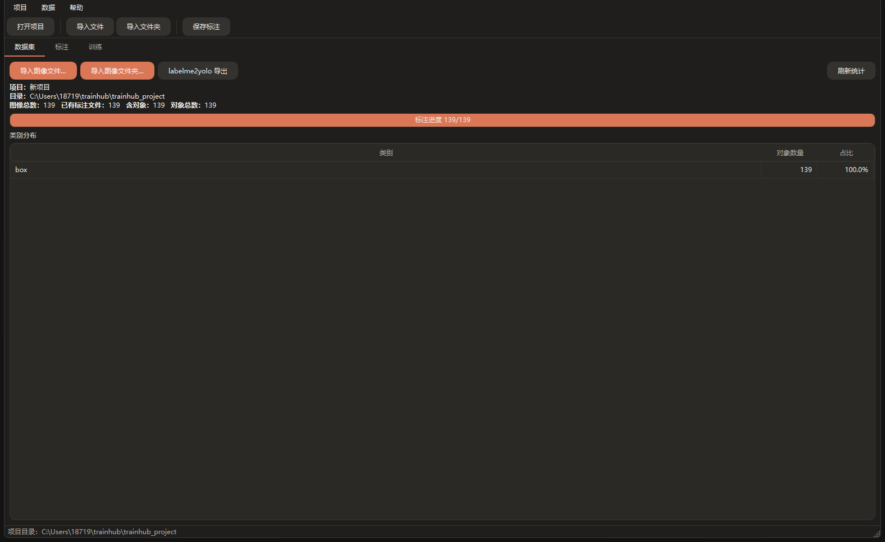
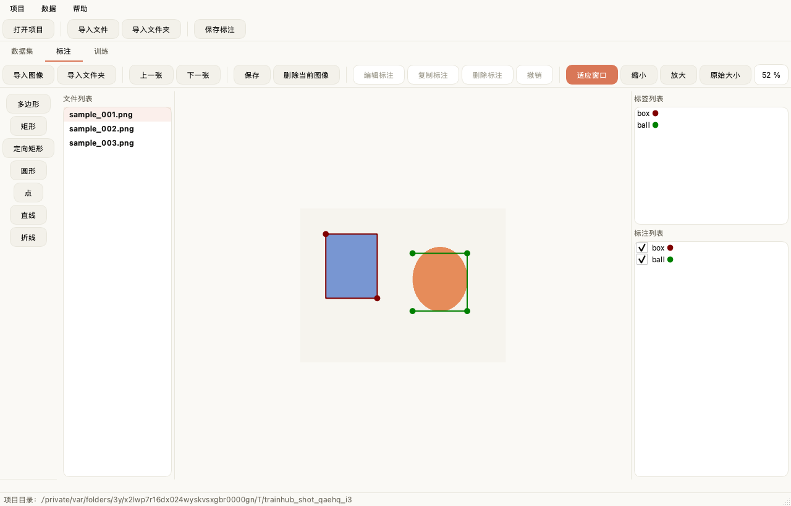
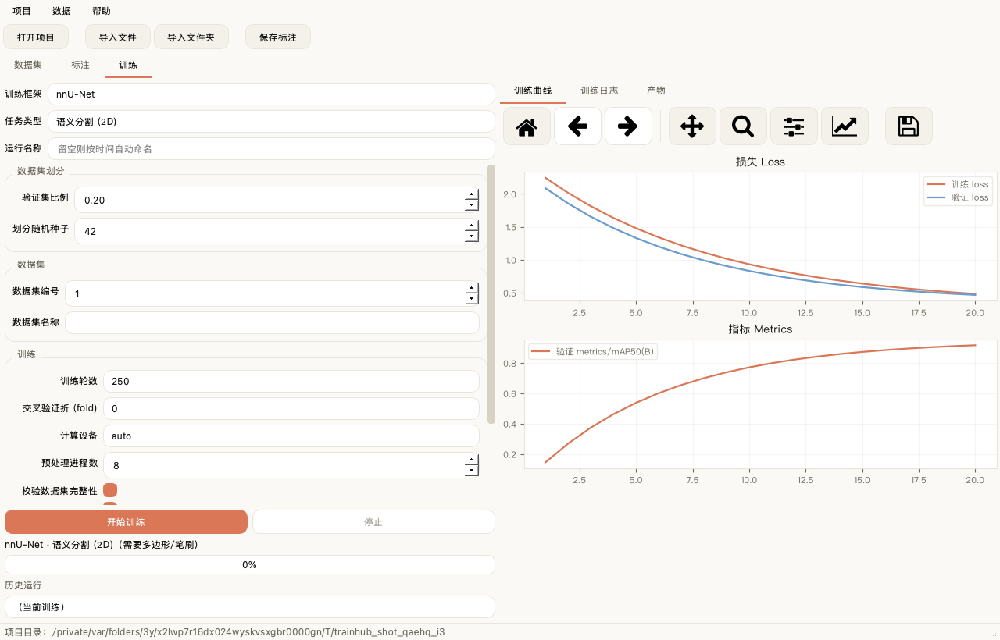

# trainhub

基于 PyQt6 的一站式「标注 → 训练 → 应用」工作站。内置 labelme 兼容的标注引擎与 AI 预标注（本地 YOLO / 视觉大模型），YOLO / nnU-Net 双训练后端，训练完可直接用产出的权重做推理预览。计算设备全平台自动适配（CUDA / MPS / CPU），训练器通过插件体系可自由扩展。

> **许可**：标注引擎移植自 GPL-3.0 的 labelme，作为衍生作品，本项目整体以 **GPL-3.0** 发布（见 [LICENSE](LICENSE)）。

## 功能一览

- **标注**：labelme 6.3.0 兼容引擎，矩形 / 多边形 / 定向矩形 / 圆 / 点 / 线 / 折线；已标注图像在列表中绿色标识。
- **AI 预标注**：本地 YOLO 权重离线推理，或接入视觉大模型（DeepSeek / 智谱 GLM / 阿里百炼 Qwen-VL 等，OpenAI 兼容接口）自动打框，带 token 用量与费用统计。
- **数据集管理**：批量导入、类别分布统计、命名冲突自动处理；labelme ↔ YOLO 双向转换。
- **训练**：YOLO（检测 / 分割 / 分类）与 nnU-Net（2D 医学分割），实时曲线与日志，历史运行回看，断点续训。
- **推理预览**：训练产出的权重一键对图像批量推理，画框结果应用内逐张预览。
- **数据安全**：清空 / 删除移入项目 `.trash/` 可找回；预标注绝不覆盖期间的手工标注。
- **可扩展**：新增训练器只需实现 `BaseTrainer` 并注册，界面与调参表单自动生成。

## 界面预览

**数据集页** | **标注页** | **训练页**

  

## 环境安装

推荐「conda 只提供 Python，其余依赖全部走 pip」——macOS arm64 上带 MPS 的 PyTorch 只在 pip 提供。

```bash
# 1. 创建环境（Python 3.11 + 全部依赖，含 torch/ultralytics/nnunetv2）
conda env create -f environment.yml
conda activate trainhub

# 2. 安装 trainhub 本身
pip install -e . --no-deps

# 3. 启动
trainhub            # 或 python -m trainhub
```

> 国内下载加速：`pip config set global.index-url https://pypi.tuna.tsinghua.edu.cn/simple`
>
> 只跑 YOLO 不需要 nnU-Net 时，可从 `environment.yml` 删掉 `nnunetv2 / nibabel / SimpleITK / scikit-learn` 等，体积小很多。

### 平台与 torch 版本明细

| 平台 | 加速后端 | 推荐 torch | 推荐 torchvision | 说明 |
|------|---------|-----------|-----------------|------|
| macOS（Apple Silicon，M1–M5） | MPS | ≥ 2.2（本机实测 **2.14.0**） | ≥ 0.17（实测 **0.29.0**） | `pip install torch torchvision` 默认即含 MPS |
| Windows（NVIDIA 独显） | CUDA | ≥ 2.2 | ≥ 0.17 | 到 [pytorch.org](https://pytorch.org/get-started/locally/) 选匹配的 CUDA wheel |
| Linux（NVIDIA 独显） | CUDA | ≥ 2.2 | ≥ 0.17 | 同上 |
| Windows / Linux（无独显） | CPU | ≥ 2.2 | ≥ 0.17 | 默认 CPU 版即可 |

> - torch 与 torchvision 必须配套，一次 `pip install torch torchvision` 自动解析。
> - 实测版本来自开发机（macOS / Apple Silicon M5 / Python 3.11.16），并已在 Windows 11 + RTX 4060 Laptop（torch 2.14.0+cu130）上验证。
> - CUDA 平台安装形如 `pip install torch torchvision --index-url https://download.pytorch.org/whl/cu124`。

## 使用教程

### 1. 启动与项目管理

```bash
trainhub                          # 新建默认项目
python -m trainhub /path/to/proj  # 打开（或新建）指定项目目录
```

界面里可通过「项目 → 新建项目… / 打开项目…」切换。项目只是一个目录，内含 `trainhub.yaml`，整目录拷贝即可迁移。

### 2. 导入数据

在「数据集」页点击 **导入图像文件…** 或 **导入图像文件夹…**：

- 普通图像按文件 / 文件夹批量导入；带同名 `.json` 的自动带上 labelme 标注；YOLO 结构的文件夹（`images/` + `labels/` + `dataset.yaml`）自动反向转换成 labelme 格式。
- **替换数据集**：导入新文件夹会清空当前项目数据（有确认提示），旧数据移入项目 `.trash/<时间戳>/`，可随时手动找回。
- **命名冲突**：同名同后缀自动改名（`name_1.jpg`）且标注一并改名；同名不同后缀（`cat.png` 与 `cat.jpg`）也改名导入但不携带归属不明的标注，导入后弹窗列出明细。

导入后，「数据集」页显示图像总数、已标注数、对象总数与各类别分布。

### 3. 标注

在「标注」页选择标签，用矩形框 / 多边形 / 圆 / 点 / 线 / 折线等工具标注；支持上 / 下一张、删除当前图像（移入 `.trash/`）、保存（Ctrl+S）。结果保存为 labelme 兼容 JSON（`annotations/` 目录，与图像同名），已标注的图像名在列表中显示为绿色。

### 4. AI 预标注

「标注」页点击 **AI 预标注**，为当前图像或全部未标注图像生成候选框，人工微调后保存。两种引擎：

**本地 YOLO 权重（离线）**——用项目里训练产出的权重（`runs/*/weights/*.pt`）或通用预训练权重推理，数据不出本机。

**大模型 API（在线）**——填一个 API Key 即可，服务商开箱即用：

| 服务商 | 模型 | 官方支持检测框 |
|--------|------|:---:|
| DeepSeek | `deepseek-flash` | ⚠️ 未声明，建议先试标 |
| 智谱 GLM | `glm-4.5v` | ✅ |
| 阿里百炼 | Qwen-VL 系列 | ✅ |
| 硅基流动 / 自定义 | 任意 OpenAI 兼容端点 | 视模型而定 |

行为与细节：

- 标注词（label）统一输出英文，原类别名存入 `other_data.label_cn` 便于对照；同一目标的英文写法不稳定时，由项目译名登记表收敛成唯一标签。
- 检测提示词只填目标名（如「木棍」或「木棍、纸箱」）时，这些词就是唯一允许的输出标签——提到几种就最多几种，多余类别程序强制丢弃。
- 批量模式实时显示统计：已处理 / 检出率 / 空结果、token 用量、缓存命中率、估算费用（≈¥，按服务商空闲档单价；未内置价格的只显示 token 数）。
- API Key 保存在本机（QSettings），不写入项目目录。
- 接入新服务商前，建议先验证检测框质量：

  ```bash
  python scripts/test_vlm_grounding.py --provider deepseek --project /path/to/proj --limit 5   # 有真值：IoU 评估
  python scripts/test_vlm_grounding.py --provider deepseek --images /path/to/images --no-gt --limit 20  # 无真值：检出率
  ```

- ⚠️ 批量模式会把图像内容上传到所选服务商；VLM 输出为矩形框，分割任务请在画布上手工调整。

### 5. 导出数据集（labelme2yolo）

「数据集」页点击 **labelme2yolo 导出**，把已标注图像转换成 Ultralytics YOLO 格式输出到 `datasets/yolo_detect/`（训练 / 验证集自动按比例切分）。

### 6. 训练

「训练」页选择 **训练框架**（YOLO / nnU-Net）与 **任务类型**，左侧表单调超参，点 **开始训练**，右侧实时查看训练曲线 / 日志 / 产物。

- 训练前自动把标注切成 **训练集 / 验证集**（比例与种子在表单「数据集划分」组可调），YOLO 写到 `runs/<运行名>/dataset/`；产物第一条是数据集切分入口，双击打开目录。
- **历史运行**：从下拉框回看任意一次训练的曲线、产物与数据集切分。
- **断点续训**：训练中断后勾选「断点续训」，运行名称填成中断那次的名字，从 `weights/last.pt` 继续（沿用中断时的参数）。
- 首次使用 YOLO 会自动下载预训练权重到 `~/.cache/trainhub/weights`。

### 7. 推理预览

「训练」页点击 **推理预览…**，选一次训练的权重与置信度阈值，对项目图像（或任选文件夹）批量推理：画框结果存到该次运行的 `predictions/` 目录，列表点选即可在应用内逐张预览，双击交给系统看图器。

## 项目目录结构

```
<项目根目录>/
├── trainhub.yaml        # 项目元数据（标签、选中的训练器/任务、上次参数）
├── images/              # 原始图像
├── annotations/         # labelme 格式的 JSON 标注（唯一源格式，永不改动）
├── datasets/            # labelme2yolo 导出的数据集
├── runs/                # 每次训练的产物（权重、日志、图表、数据集切分、推理结果）
└── .trash/              # 被替换/删除的旧数据（按时间戳归档，可手动找回）
```

## 训练后端说明

- **YOLO（Ultralytics）**：`detect / segment / classify` 三任务；设备 `auto / cuda / mps / cpu`，`auto` 按平台自动选择（CUDA → MPS → CPU），所选设备不可用时自动回退并提示。标注在训练前自动转换为 YOLO 格式，原始 labelme JSON 不动。
- **nnU-Net**：2D 医学分割。标注自动栅格化为 PNG 掩膜并生成 nnU-Net raw 数据集；按比例留出测试集（不参与训练），训练集内部由 nnU-Net 做 5 折交叉验证。程序自动设置 `nnUNet_raw / nnUNet_preprocessed / nnUNet_results` 到项目目录，不污染全局。

## 可扩展性

新增一个训练器：

```python
from trainhub.core.trainer import BaseTrainer, TaskSpec
from trainhub.core.registry import register_trainer

@register_trainer
class MyTrainer(BaseTrainer):
    key = "mytrainer"
    display_name = "我的训练器"
    tasks = (TaskSpec("detect", "目标检测", "bbox", "2d", "矩形框标注"),)

    def is_available(self): ...
    def param_specs(self, task_key): ...
    def prepare(self, job, prepared, sink): ...
    def train(self, job, prepared, sink): ...
```

界面上的训练框架下拉框、调参表单、实时曲线会自动适配，无需改动 UI 代码。

## 测试与 CI

```bash
pytest tests -q
```

覆盖 labelme ↔ YOLO 双向转换 round-trip、标签归一化与译名收敛、VLM 响应解析、token 统计等；GitHub Actions 在 push / PR 时自动运行（`.github/workflows/ci.yml`）。

## 已知问题

- 设备 `auto` 优先级为 CUDA → MPS → CPU，无独显机器自动落到 CPU，属预期行为。
- MPS 对 AMP（混合精度）支持不完整，Apple 机器建议保持关闭（默认关闭）；NVIDIA GPU 可开启加速。
- nnU-Net 部分算子 MPS 未实现，程序已自动开启 `PYTORCH_ENABLE_MPS_FALLBACK` 回退 CPU。
- VLM 预标注输出为矩形框，分割任务的多边形需人工调整（VLM 打框 + SAM 出掩膜的两阶段管线在规划中）。

## 致谢

标注引擎移植自 [labelme](https://github.com/wkentaro/labelme) 6.3.0（GPL-3.0），标注格式与其完全兼容；作为其衍生作品，本项目整体以 GPL-3.0 许可发布，感谢 labelme 及其贡献者。
